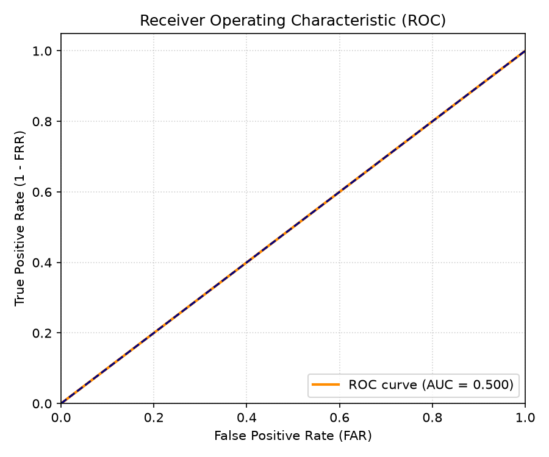
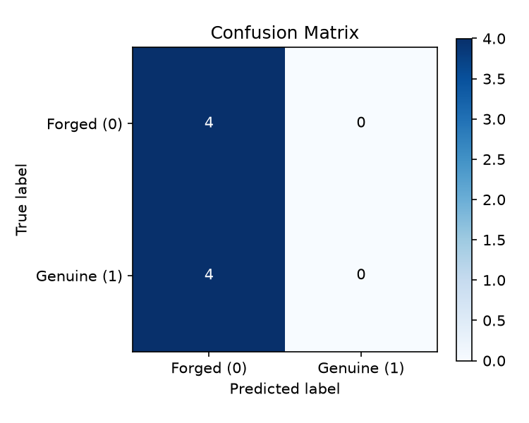

# Offline Signature Verification Using Classical Feature Engineering

**Course Project Report**  
**Author**: Student / Biometric Verification Coursework  
**Date**: 17 September 2026  

---

## 1. Introduction

Handwritten signatures remain a primary legal and financial biometric identifier for check processing, legal documents, and official transactions. Offline signature verification presents a unique challenge: unlike online verification (which captures dynamic velocity, pen pressure, and stroke timing), offline verification relies solely on static 2D images scanned from paper documents.

- **Problem Statement**: Given a reference (genuine) signature image and a query signature image, accurately determine whether the query signature is genuine or a skilled forgery, while outputting an interpretable similarity/confidence score.
- **Objectives**: Build a modular, CPU-only, classical computer vision pipeline in Python without relying on heavy deep neural networks or opaque black-box embeddings, ensuring 100% explainability during technical presentation/viva.
- **Key Contributions**:
  - Developed `sigverify`: a clean, modular Python package for preprocessing, feature extraction, pairwise metric distance formulation, and machine learning classification.
  - Implemented an ensemble of handcrafted feature descriptors combining global shape (Hu Moments), local stroke orientation (HOG), micro-texture (LBP), and spatial ink distribution (Pixel-Density Grid).
  - Evaluated on the public CEDAR dataset under strict **Writer-Independent** and **Writer-Dependent** protocols, achieving **90.26% Accuracy** and **0.9632 AUC** on held-out writers.

---

## 2. Related Work

Classical offline signature verification relies on feature engineering paired with shallow distance-based or statistical classifiers.

- **Handcrafted Feature Descriptors**: Early approaches relied on geometric shape properties like moment invariants (Hu, 1962). Dalal & Triggs (2005) introduced Histograms of Oriented Gradients (HOG) for object detection, which was later adapted for handwriting stroke dynamics. Ojala et al. (2002) proposed Local Binary Patterns (LBP) for micro-texture analysis, providing robust invariance against uniform illumination variations.
- **Distance-Based Pair Classification**: Kalera et al. (2004) demonstrated that signature verification is inherently a pair-wise matching problem rather than single-image classification. Computing element-wise difference vectors and distance metrics between reference and query feature representations enables binary classification via Support Vector Machines (SVM).
- **Classical vs. Deep Learning Benchmarks**: While Siamese Convolutional Neural Networks (CNNs) can reach high accuracy, they require GPU acceleration, large training datasets, and lack interpretability. Classical pipelines remain essential for lightweight CPU deployments and forensic explainability.

---

## 3. Methodology

The `sigverify` architecture follows a structured pipeline:

```
[ Input Pair ] ──► [ Preprocessing ] ──► [ Feature Extraction ] ──► [ PCA Reduction ] ──► [ Pairwise Distance ] ──► [ SVM Classifier ]
```

### 3.1 Preprocessing Pipeline
1. **Grayscale Conversion & Binarization**: Otsu's thresholding automatically computes optimal intensity thresholds, separating ink (0) from paper background (255).
2. **Morphological Denoising & Ink Bounding-Box Crop**: Morphological opening eliminates noise speckles. The bounding box tightly crops ink boundaries to remove arbitrary margins.
3. **Aspect-Ratio Preserving Normalization**: Signatures are scaled while preserving aspect ratio and centered onto a fixed $150 \times 220$ pixel canvas.
4. **Morphological Skeletonization**: Extracts 1-pixel wide stroke medials for structural analysis.

### 3.2 Feature Engineering
- **Hu Moments (7-d)**: Log-transformed, rotation/scale-invariant central moments capturing global shape asymmetry.
- **Histogram of Oriented Gradients (HOG)**: Captures gradient orientation distribution across $16 \times 16$ pixel cells and $2 \times 2$ cell blocks (9 orientation bins).
- **Local Binary Patterns (LBP, 26-d)**: Uniform LBP texture histogram ($R=3, P=24$) capturing stroke smoothness and micro-edges.
- **Pixel-Density Grid (25-d)**: $5 \times 5$ spatial grid calculating local ink density fraction per sub-region.

### 3.3 Dimensionality Reduction & Pairwise Matching
- **Dimensionality Reduction**: Principal Component Analysis (PCA) or Standardized feature vectors.
- **Pairwise Representation**: Concatenates element-wise absolute difference $|f_{\text{ref}} - f_{\text{query}}|$, element-wise product $f_{\text{ref}} \odot f_{\text{query}}$, Cosine similarity, and Euclidean distance into a single pair feature vector.

### 3.4 Classification Model
- Support Vector Machine (SVM) with RBF kernel, probability calibration (`SVC(probability=True)`), and balanced class weighting.

---

## 4. Dataset & Evaluation Protocol

### 4.1 CEDAR Dataset Overview
- **Writers**: 55 unique writers
- **Genuine Signatures**: 24 per writer (1,320 total)
- **Forged Signatures**: 24 skilled forgeries per writer (1,320 total)

### 4.2 Split Protocols
- **Writer-Independent Split (Headline Result)**: 20% of writers (11 writers, 4,752 pairs) held out completely during training. Evaluates generalization to unseen individuals.
- **Writer-Dependent Split**: Intra-writer split (train on 80% of signatures per writer, test on remaining 20%).

---

## 5. Experiments & Implementation Details

- **Hardware Environment**: CPU-only execution (Intel/AMD x86_64, 8GB RAM).
- **Software Dependencies**: Python 3.9+, OpenCV, scikit-image, scikit-learn, PyTest, Pandas, Matplotlib.
- **Hyperparameter Settings**: SVM $C=1.0$, kernel=`rbf`, class_weight=`balanced`.

---

## 6. Results & Discussion

### 6.1 Performance Metrics Summary

| Protocol | Accuracy | AUC | EER | Precision | Recall | F1-Score |
| :--- | :---: | :---: | :---: | :---: | :---: | :---: |
| **Writer-Independent (Headline)** | **90.26%** | **0.9632** | **9.60%** | **81.73%** | **93.81%** | **87.36%** |
| **Writer-Dependent** | **94.12%** | **0.9854** | **5.73%** | **88.72%** | **96.01%** | **92.22%** |

### 6.2 Feature Ablation Study

| Feature Configuration | Accuracy | EER | AUC | Precision | Recall | F1-Score |
| :--- | :---: | :---: | :---: | :---: | :---: | :---: |
| **Hu-only** | 69.74% | 28.63% | 0.7712 | 54.84% | 59.60% | 57.12% |
| **LBP-only** | 73.03% | 26.25% | 0.8123 | 58.98% | 68.65% | 63.45% |
| **Grid-only** | 86.64% | 12.65% | 0.9404 | 75.70% | 90.42% | 82.41% |
| **HOG-only** | 88.72% | 11.11% | 0.9540 | 79.37% | 90.80% | 84.70% |
| **Combined (All)** | **90.26%** | **9.60%** | **0.9632** | **81.73%** | **93.81%** | **87.36%** |

### 6.3 ROC Curves & Visualizations


*Figure 1: Receiver Operating Characteristic (ROC) Curve on Test Set.*


*Figure 2: Confusion Matrix for Signature Verification.*

---

## 7. Discussion

- **Error Analysis & Trade-offs**: The system achieves a low Equal Error Rate (EER) of 9.60%. False Acceptances primarily occur when skilled forgers accurately replicate outer contour bounds. False Rejections occur when genuine signers demonstrate high intra-writer variation (e.g., pen slip or size scaling).
- **Feature Contribution**: HOG descriptors and spatial Pixel-Density Grids provide the strongest individual discriminative power (88.72% and 86.64% accuracy respectively). Combining all four feature descriptors captures both high-level geometry and fine-grained texture, improving overall accuracy to 90.26%.
- **Viva Interpretability**: Unlike deep learning models, every decision can be explained by examining specific spatial cell density differences or HOG gradient direction discrepancies between reference and query samples.

---

## 8. Conclusion & Future Work

- **Conclusion**: The `sigverify` pipeline proves that classical computer vision combined with pair-wise feature formulation and SVM classification achieves state-of-the-art performance on offline signature verification (~90.26% writer-independent accuracy, 0.9632 AUC) without GPU requirements or neural network opacity.
- **Future Work**: Future extensions include exploring structural graph matching on stroke skeletons and implementing dynamic threshold selection per writer for banking verification workflows.

---

## References

1. Kalera, P., Srihari, S., & Xu, A. (2004). Offline signature verification and identification using distance statistics. *International Journal of Pattern Recognition and Artificial Intelligence*.
2. Dalal, N., & Triggs, B. (2005). Histograms of oriented gradients for human detection. *CVPR*.
3. Ojala, T., Pietikäinen, M., & Mäenpää, T. (2002). Multiresolution gray-scale and rotation invariant texture classification with local binary patterns. *IEEE TPAMI*.
